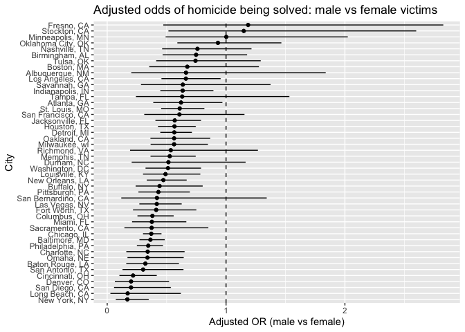
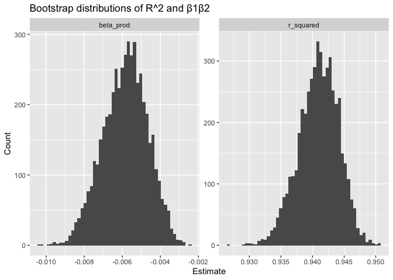
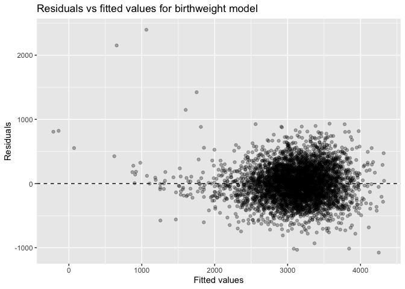
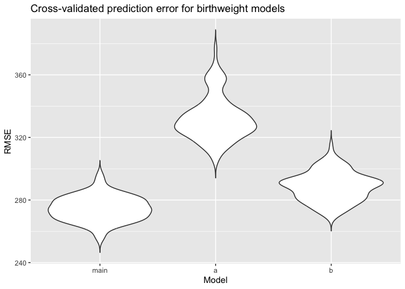

p8105_hw6_ab6169
================
Amrutha Banda
2025-11-30

# Problem 1

``` r
homicides_raw = 
  read_csv("data/homicide-data.csv") |>
  janitor::clean_names()


homicides =
  homicides_raw |>
  mutate(
    city_state = str_c(city, state, sep = ", "),
    resolved = case_when(
      disposition %in% c("Closed by arrest") ~ 1,
      disposition %in% c("Open/No arrest")  ~ 0,
      TRUE ~ NA_real_),
    victim_race = str_to_lower(victim_race)) |>
  
  filter( #omitting cities 
    !city_state %in% c("Dallas, TX", "Phoenix, AZ", "Kansas City, MO", "Tulsa, AL"),
    victim_race %in% c("white", "black")) |> #limiting analysis to white and black
  mutate(
    victim_age = as.numeric(victim_age), #made it numeric 
    victim_sex = factor(victim_sex),
    victim_race = factor(victim_race),
    city_state = factor(city_state)) |>
  drop_na(resolved, victim_age, victim_sex, victim_race)
```

Baltimore,MD

``` r
baltimore_df =
  homicides |>
  filter(city_state == "Baltimore, MD")

baltimore_fit =
  glm( #logistic regression 
    resolved ~ victim_age + victim_sex + victim_race,
    data = baltimore_df,
    family = binomial())

baltimore_tidy =
  baltimore_fit |>
  tidy(conf.int = TRUE, exponentiate = TRUE)

baltimore_tidy |>
  filter(term == "victim_sexMale") |>
  select(term, estimate, conf.low, conf.high)
```

    ## # A tibble: 1 × 4
    ##   term           estimate conf.low conf.high
    ##   <chr>             <dbl>    <dbl>     <dbl>
    ## 1 victim_sexMale    0.363    0.271     0.484

Fitting glm for each city

``` r
city_fits =
  homicides |>
  nest(data = -city_state) |>
  mutate(
    model = map(
      data,
      ~ glm(
        resolved ~ victim_age + victim_sex + victim_race,
        data = .x,
        family = binomial())),
    results = map(
      model,
      ~ tidy(.x, conf.int = TRUE, exponentiate = TRUE))) |>
  select(city_state, results) |>
  unnest(results) |>
  filter(term == "victim_sexMale") |>
  select(city_state, estimate, conf.low, conf.high)
```

Plot of Estimated ORs and CIs

``` r
city_fits |>
  mutate(city_state = fct_reorder(city_state, estimate)) |>
  ggplot(aes(x = city_state, y = estimate)) +
  geom_point() +
  geom_errorbar(aes(ymin = conf.low, ymax = conf.high), width = 0) +
  geom_hline(yintercept = 1, linetype = "dashed") +
  coord_flip() +
  labs(
    x = "City",
    y = "Adjusted OR (male vs female)",
    title = "Adjusted odds of homicide being solved: male vs female victims"
  )
```

<!-- -->
Comments: The plot shows that the odds ratios differ a lot from city to
city. Some cities have estimates above 1, meaning cases with male
victims seem more likely to be solved there. Other cities have estimates
below 1, meaning cases with male victims seem less likely to be solved.
In many cities, the confidence intervals are wide and include 1, so
there is no clear difference between male and female victims. Overall,
the results vary by city and in many places, the evidence is not very
strong in either direction.

# Problem 2

Bootstrap samples

``` r
data("weather_df")
set.seed(1)

weather_lm =
  lm(tmax ~ tmin + prcp, data = weather_df)

boot_straps =
  weather_df |>
  bootstrap(n = 5000)
```

``` r
boot_results =
  boot_straps |>
  mutate(
    models = map(strap, ~ lm(tmax ~ tmin + prcp, data = .x)),
    glance  = map(models, glance),
    tidy = map(models, tidy)) |>
  mutate(
    r_squared = map_dbl(glance, ~ .x$r.squared),
    beta_prod = map_dbl(
      tidy,
      ~ {
        b1 = .x |> filter(term == "tmin") |> pull(estimate)
        b2 = .x |> filter(term == "prcp") |> pull(estimate)
        b1 * b2}
    )
  ) |>
  select(.id, r_squared, beta_prod)
```

plot

``` r
boot_results |>
  pivot_longer(
    cols = c(r_squared, beta_prod),
    names_to = "quantity",
    values_to = "estimate") |>
  ggplot(aes(x = estimate)) +
  geom_histogram(bins = 50) +
  facet_wrap(~ quantity, scales = "free") +
  labs(
    title = "Bootstrap distributions of R^2 and β1β2",
    x = "Estimate",
    y = "Count"
  )
```

<!-- -->
Description: In this plot, the R squared values are tightly grouped and
form a narrow peak, which means the model gives very similar R squared
values across the bootstrap samples. The beta product values have a
wider spread but still form a fairly symmetric shape centered near zero.
Overall, both distributions look smooth and the bootstrap results show
how much these estimates can vary when the data are resampled.

95% CI

``` r
 boot_results |>
  summarize(
    r2_lower = quantile(r_squared, 0.025),
    r2_upper = quantile(r_squared, 0.975),
    bp_lower = quantile(beta_prod, 0.025),
    bp_upper = quantile(beta_prod, 0.975)
  )
```

    ## # A tibble: 1 × 4
    ##   r2_lower r2_upper bp_lower bp_upper
    ##      <dbl>    <dbl>    <dbl>    <dbl>
    ## 1    0.934    0.947 -0.00821 -0.00371

To form the 95 percent confidence intervals, I took the 2.5th and 97.5th
percentiles of the 5000 bootstrap estimates. For R squared, the interval
is roughly 0.934 to 0.947, which is very narrow and matches the tight
distribution in the histogram. For the product of the two coefficients,
the interval goes from about -0.0082 to -0.0037. This interval is wider
and reflects the greater variation in the beta product compared to R
squared. These percentile intervals give a sense of the range of values
we would expect for each quantity across repeated samples.

# Problem 3

``` r
birthweight_raw =
  read_csv("data/birthweight.csv") |>
  janitor::clean_names()
```

``` r
birthweight =
  birthweight_raw |>
  mutate(
    babysex = factor(babysex, levels = c(1, 2), labels = c("male", "female")),
    frace   = factor(frace),
    mrace   = factor(mrace),
    malform = factor(malform, levels = c(0, 1), labels = c("absent", "present"))
  )

birthweight |>
  summarize(across(everything(), ~ sum(is.na(.)))) #checked for missing data 
```

    ## # A tibble: 1 × 20
    ##   babysex bhead blength   bwt delwt fincome frace gaweeks malform menarche
    ##     <int> <int>   <int> <int> <int>   <int> <int>   <int>   <int>    <int>
    ## 1       0     0       0     0     0       0     0       0       0        0
    ## # ℹ 10 more variables: mheight <int>, momage <int>, mrace <int>, parity <int>,
    ## #   pnumlbw <int>, pnumsga <int>, ppbmi <int>, ppwt <int>, smoken <int>,
    ## #   wtgain <int>

Regression

``` r
bw_fit_main =
  lm(
    bwt ~ gaweeks + blength + bhead + babysex +
      wtgain + ppbmi + smoken + momage + mrace,
    data = birthweight
  )

bw_fit_main |> tidy()
```

    ## # A tibble: 12 × 5
    ##    term          estimate std.error statistic   p.value
    ##    <chr>            <dbl>     <dbl>     <dbl>     <dbl>
    ##  1 (Intercept)   -5777.     103.       -56.2  0        
    ##  2 gaweeks          11.1      1.47       7.54 5.52e- 14
    ##  3 blength          76.5      2.02      37.9  2.30e-271
    ##  4 bhead           132.       3.47      38.1  2.91e-274
    ##  5 babysexfemale    32.0      8.51       3.76 1.73e-  4
    ##  6 wtgain            4.16     0.396     10.5  2.11e- 25
    ##  7 ppbmi             6.84     1.34       5.09 3.76e-  7
    ##  8 smoken           -4.62     0.589     -7.85 5.04e- 15
    ##  9 momage            1.97     1.17       1.69 9.17e-  2
    ## 10 mrace2         -143.       9.81     -14.5  9.07e- 47
    ## 11 mrace3         -105.      42.8       -2.45 1.44e-  2
    ## 12 mrace4         -135.      18.9       -7.15 1.02e- 12

``` r
bw_fit_main |> glance()
```

    ## # A tibble: 1 × 12
    ##   r.squared adj.r.squared sigma statistic p.value    df  logLik    AIC    BIC
    ##       <dbl>         <dbl> <dbl>     <dbl>   <dbl> <dbl>   <dbl>  <dbl>  <dbl>
    ## 1     0.714         0.713  274.      982.       0    11 -30532. 61089. 61172.
    ## # ℹ 3 more variables: deviance <dbl>, df.residual <int>, nobs <int>

Residuals vs Fitted plot

``` r
birthweight_resid =
  birthweight |>
  add_predictions(bw_fit_main) |>
  add_residuals(bw_fit_main)

birthweight_resid |>
  ggplot(aes(x = pred, y = resid)) +
  geom_point(alpha = 0.3) +
  geom_hline(yintercept = 0, linetype = "dashed") +
  labs(
    x = "Fitted values",
    y = "Residuals",
    title = "Residuals vs fitted values for birthweight model"
  )
```

<!-- -->
Description: For my main model, I chose predictors that are directly
related to how a baby grows and factors that can affect birthweight. I
included gestational age, length at birth, and head circumference
because these measure the baby’s size and development. I also added baby
sex, maternal weight gain, pre pregnancy BMI, smoking during pregnancy,
maternal age, and maternal race, since these are common factors that can
influence birthweight. This gave me a model that includes both newborn
measurements and key maternal characteristics.

To check how well the model fits, I used add_predictions and
add_residuals to make a residuals versus fitted values plot. The
residuals are centered around zero and do not show a strong pattern,
which suggests the model is reasonable. There is some variation in the
residuals at higher fitted values, but overall the plot does not show
major problems like strong curvature or obvious trends.

Comparison

*length at birth and gestational age*

``` r
bw_fit_a =
  lm(bwt ~ blength + gaweeks, data = birthweight)
```

*head circumference, length, sex, and all interactions*

``` r
bw_fit_b =
  lm(
    bwt ~ bhead * blength * babysex,
    data = birthweight)
```

cross validation

``` r
set.seed(1)

#defined the formulas 
form_main = bwt ~ gaweeks + blength + bhead + babysex +
  wtgain + ppbmi + smoken + momage + mrace

form_a = bwt ~ blength + gaweeks

form_b = bwt ~ bhead * blength * babysex

cv_df =
  crossv_mc(birthweight, n = 100, test = 0.2) |>
  mutate(
    train = map(train, as_tibble),
    test  = map(test,  as_tibble)
  )

fit_lm = function(formula, data) {
  lm(formula, data = data)
}

rmse_lm = function(model, data) {
  pred = predict(model, newdata = data)
  sqrt(mean((data$bwt - pred)^2))
}

#Fitting all 3 models
cv_results =
  cv_df |>
  mutate(
    mod_main = map(train, ~ fit_lm(form_main, .x)),
    mod_a  = map(train, ~ fit_lm(form_a, .x)),
    mod_b = map(train, ~ fit_lm(form_b, .x))
  ) |>
  mutate(
    rmse_main = map2_dbl(mod_main, test, rmse_lm),
    rmse_a = map2_dbl(mod_a, test, rmse_lm),
    rmse_b = map2_dbl(mod_b, test, rmse_lm)
  )

#pivoting
cv_results_long =
  cv_results |>
  select(starts_with("rmse_")) |>
  pivot_longer(
    cols = everything(),
    names_to = "model",
    values_to = "rmse",
    names_prefix = "rmse_"
  ) |>
  mutate(model = fct_inorder(model))

#Violin Plot 
cv_results_long |>
  ggplot(aes(x = model, y = rmse)) +
  geom_violin(trim = FALSE) +
  labs(
    x = "Model",
    y = "RMSE",
    title = "Cross-validated prediction error for birthweight models"
  )
```

<!-- -->
Description: To compare the three models, I used cross-validated RMSE as
the measure of prediction error. The simpler model with only length and
gestational age (model a) has the highest RMSE values. This means it
does not predict birthweight as well as the other models. The
interaction model (model b) has lower RMSE than model a, but it shows
more variability across the cross-validation splits, likely because it
is a more complex model with many terms. My main model generally has the
lowest RMSE and is also more stable across the different resampled
datasets. This suggests that my main model provides the best balance
between including important predictors and maintaining good predictive
performance.
